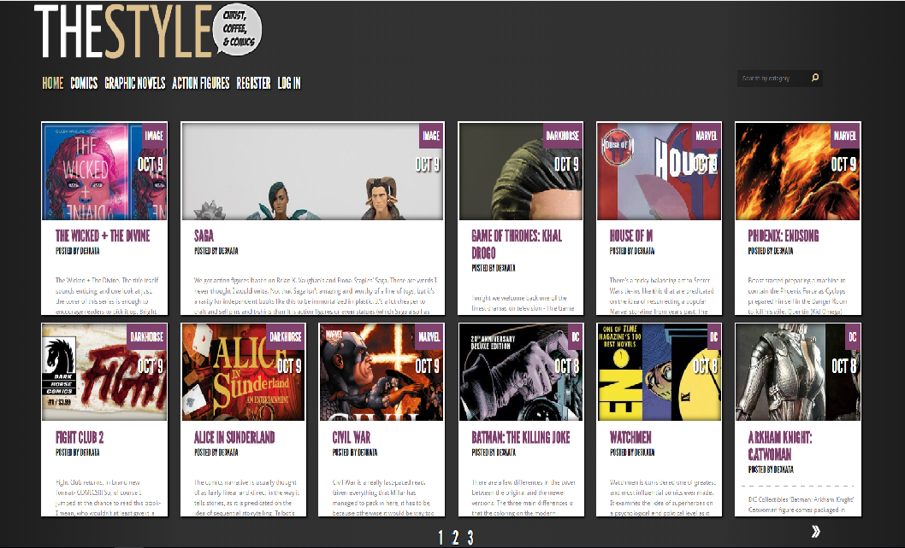
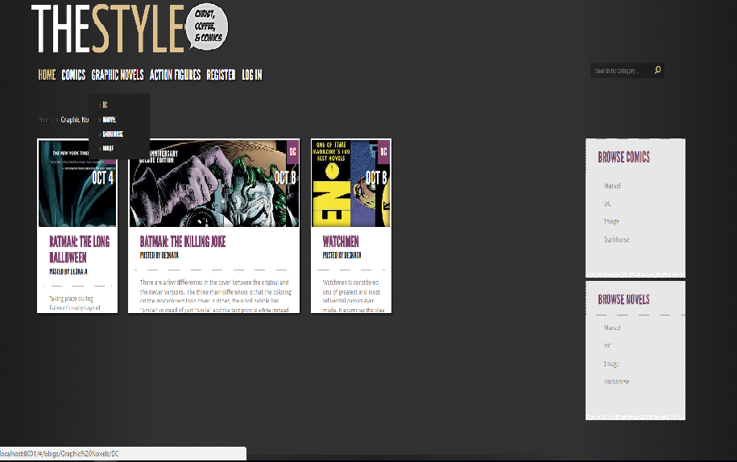

# TheStyle Comic Blog
  - Online blog type site for comic reviews. Fast and easy way to read about your favorite issues, post comments about a particular review and create your own review.
-----------------------------------------------------------------------------------------------------------------------

## Web front-end development

### Front End
- Handlebars
- JQuery
- Sammy
- System.js

### Back End
- Express
- MongoDB
- Node.js

## API End points

### Blogs

- **GET** -> /blogs
- **GET** -> /blogs/:id
- **GET** -> /search/category/:category
- **GET** -> /search/subcategory/:subcategory
- **GET** -> /blogs/:subcategory/:category
- **POST** -> /blogs/:subcategory/:category
- **POST** -> /blogs

### Comments

- **POST** -> /blogs/:id

### Users

- **GET** -> /users
- **GET** -> /users/:id
- **POST** -> /register
- **POST** -> /login
- **POST** -> /logout

## Getting started
Clone the repository and then run:
```
npm install
```

To start the server:
```
npm start
```
-----------------------------------------------------------------------------------------------------------------------

## Author

|Name                 | http://telerikacademy.com profile                        |https://github.com profile                |
|:-------------------:|:--------------------------------------------------------:|:----------------------------------------:|
|Desislava Ivanova    |[derketo](https://telerikacademy.com/Users/derketo)       |[de3ka](https://github.com/de3ka)         |


-----------------------------------------------------------------------------------------------------------------------




-----------------------------------------------------------------------------------------------------------------------